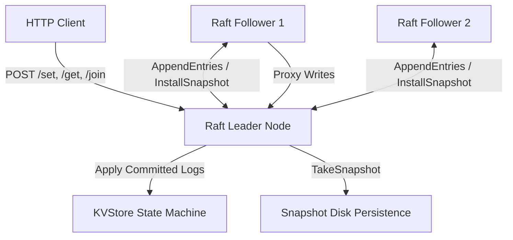

# hotaru

a lightweight distributed consensus engine and replicated key-value database built in raw go from first principles. no etcd/raft, no hashicorp/raft, no heavy third party consensus libraries. just the raft paper and go's standard library.

---

## features

**core raft consensus**
- leader election with randomized timeouts (150ms to 300ms) to prevent split vote scenarios
- log replication with strict term matching and safety checks
- automatic state recovery and persistence across node restarts

**log compaction and snapshotting**
- state machine snapshotting to trim historical log entries and bound memory usage
- `InstallSnapshot` RPC to fast forward slow or rejoining followers

**dynamic cluster membership**
- live cluster scaling with `/join` and `/leave` HTTP endpoints, implementing diego ongaro's single server change algorithm without cluster downtime
- non voting staging phase for new nodes to catch up on logs before gaining voting rights
- automatic self removal step-down for leaders

**HTTP client API and proxying**
- RESTful endpoints (`/set`, `/get`, `/del`, `/join`, `/leave`)
- follower to leader request proxying for write operations
- linearizable reads via heartbeat leader validation (`VerifyLeadership`)

**performance optimizations**
- fast forward log conflict recovery (`ConflictIndex` and `ConflictTerm`) to eliminate 1by-1 RPC step-backs
- eager replication triggers for sub 15ms proposal latency

---

## architecture



---

## quickstart and API reference

### 1. run the full test suite
hotaru includes a comprehensive integration test suite verifying election failover, follower proxying, log compaction, dynamic membership scaling, and performance benchmarking:

```bash
git clone https://github.com/pranav718/hotaru.git
cd hotaru
go run main.go
```

### 2. HTTP API endpoints

| endpoint | method | query parameters | description |
|---|---|---|---|
| `/set` | `POST` | `key=foo&value=bar` | propose a key-value pair to the raft leader |
| `/get` | `GET` | `key=foo` | perform a linearizable read query |
| `/del` | `DELETE` | `key=foo` | propose deletion of a key |
| `/join` | `POST` | `id=3&addr=127.0.0.1:8003` | stage and join a new node dynamically |
| `/leave` | `POST` | `id=3` | safely remove a node from the cluster |

#### example curl requests:

```bash
# write a key-value pair
curl -X POST "http://127.0.0.1:8010/set?key=gopher&value=hotaru"

# read a key (linearizable)
curl "http://127.0.0.1:8010/get?key=gopher"

# delete a key
curl -X DELETE "http://127.0.0.1:8010/del?key=gopher"

# dynamically join a node (ID 3)
curl -X POST "http://127.0.0.1:8010/join?id=3&addr=127.0.0.1:8003"

# dynamically remove a node (ID 3)
curl -X POST "http://127.0.0.1:8010/leave?id=3"
```

---

## blog

we wrote a detailed blog post explaining how raft consensus works from scratch, using a playground analogy to make the hard parts click, and then walking through how we actually built hotaru step by step.

read it here: [raft consensus explained simply, then built in go](https://medium.com/@knightkun/raft-consensus-explained-simply-then-built-in-go-f642531b6527)
