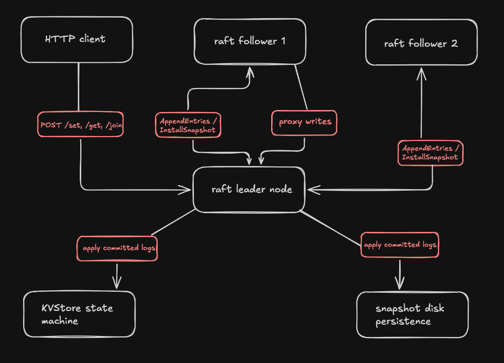
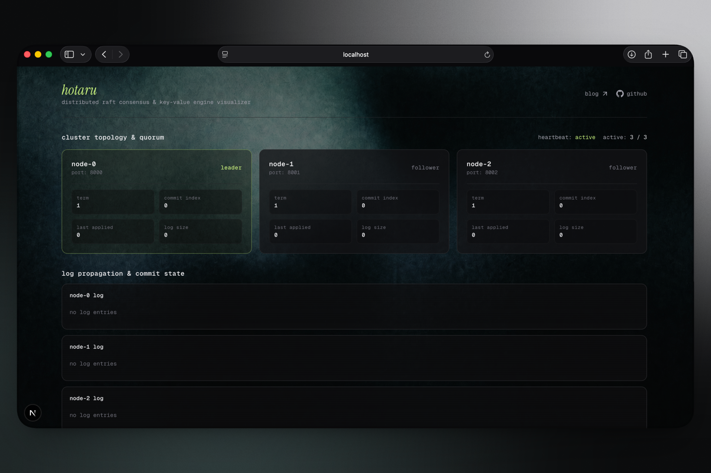
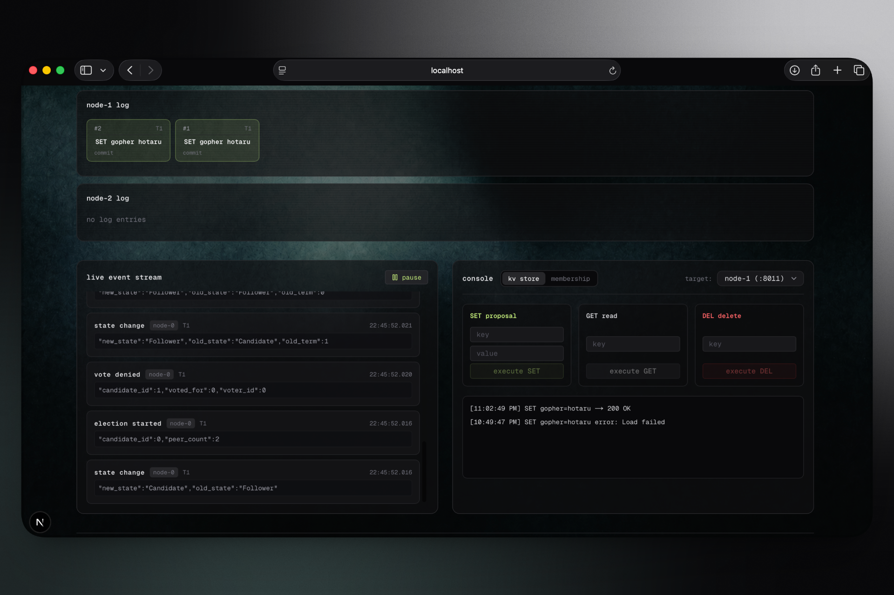

# hotaru

a lightweight distributed consensus engine and replicated key-value database built in raw go from first principles. no etcd/raft, no hashicorp/raft, no heavy third party consensus libraries. just the raft paper and go's standard library.

---

## contents

- [features](#features)
- [architecture](#architecture)
- [real-time web dashboard](#real-time-web-dashboard)
  - [dashboard preview](#dashboard-preview)
  - [how to run the web dashboard](#how-to-run-the-web-dashboard)
  - [using the web dashboard](#using-the-web-dashboard)
- [quickstart and API reference](#quickstart-and-api-reference)
- [project structure](#project-structure)
- [how raft works in hotaru](#how-raft-works-in-hotaru)
- [blog](#blog)
- [acknowledgments](#acknowledgments)

---

## features

**core raft consensus**
- leader election with randomized timeouts (150ms to 300ms) to prevent split vote scenarios
- log replication with strict term matching and safety checks
- automatic state recovery and persistence across node restarts

**real-time web dashboard**
- live visualizer built with next.js, tailwind css, framer motion, and lenis smooth scroll
- server-sent events (SSE) streaming real-time leader elections, log propagation, and state transitions directly from the go binary
- interactive console to issue proposals (SET, GET, DEL) and scale cluster membership (JOIN, LEAVE)

**log compaction and snapshotting**
- state machine snapshotting to trim historical log entries and bound memory usage
- `InstallSnapshot` RPC to fast forward slow or rejoining followers

**dynamic cluster membership**
- live cluster scaling with `/join` and `/leave` HTTP endpoints, implementing diego ongaro's single server change algorithm without cluster downtime
- non voting staging phase for new nodes to catch up on logs before gaining voting rights
- automatic self removal step-down for leaders

**HTTP client API and proxying**
- RESTful endpoints (`/set`, `/get`, `/del`, `/join`, `/leave`, `/status`, `/events`)
- follower to leader request proxying for write operations
- linearizable reads via heartbeat leader validation (`VerifyLeadership`)

**performance optimizations**
- fast forward log conflict recovery (`ConflictIndex` and `ConflictTerm`) to eliminate 1-by-1 RPC step-backs
- eager replication triggers for sub 15ms proposal latency

---

## architecture



---

## real-time web dashboard

hotaru includes an interactive real-time dashboard built with next.js and tailwind css that connects directly to the go cluster via server-sent events (SSE).

### dashboard preview



*cluster topology view displaying leader status, follower roles, terms, commit indices, and live state transitions.*



*interactive console and log propagation visualizer showing real-time log entries replicated across all nodes.*

---

### how to run the web dashboard

#### 1. start the raft cluster in dashboard mode
in your terminal, launch the 3-node go cluster with dashboard mode enabled:
```bash
go run main.go --dashboard
```
*this starts three raft nodes on ports 8000, 8001, and 8002, with HTTP API / SSE servers listening on ports 8010, 8011, and 8012.*

#### 2. start the next.js dashboard frontend
in a separate terminal window, start the next.js development server:
```bash
cd dashboard
npm install
npm run dev
```

open `http://localhost:3000` in your browser.

---

### using the web dashboard

- **cluster topology & quorum**: monitor active node roles (`leader`, `follower`), term numbers, commit indices, last applied entries, and total log sizes in real time.
- **log propagation & commit state**: view uncommitted vs. committed log entries replicated live across `node-0`, `node-1`, and `node-2`.
- **live event stream**: watch real-time cluster events (leader heartbeats, elections, proposals, snapshot saves) emitted via SSE.
- **interactive console**:
  - **kv store tab**: target any cluster node (e.g. `node-0 (:8010)`) and execute `SET`, `GET`, or `DEL` operations directly.
  - **membership tab**: dynamically propose `JOIN` or `LEAVE` operations to add or remove nodes live without cluster downtime.

---

## quickstart and API reference

### 1. run the full integration test suite
```bash
git clone https://github.com/pranav718/hotaru.git
cd hotaru
go run main.go
```

### 2. HTTP API endpoints

| endpoint | method | query parameters | description |
|---|---|---|---|
| `/set` | `POST` | `key=foo&value=bar` | propose a key-value pair to the raft leader |
| `/get` | `GET` | `key=foo` | perform a linearizable read query |
| `/del` | `DELETE` | `key=foo` | propose deletion of a key |
| `/join` | `POST` | `id=3&addr=127.0.0.1:8003` | stage and join a new node dynamically |
| `/leave` | `POST` | `id=3` | safely remove a node from the cluster |
| `/status` | `GET` | none | fetch current node status and cluster state |
| `/events` | `GET` | none | SSE event stream emitting real-time cluster events |

#### example curl requests:

```bash
# write a key-value pair
curl -X POST "http://127.0.0.1:8010/set?key=gopher&value=hotaru"

# read a key (linearizable)
curl "http://127.0.0.1:8010/get?key=gopher"

# delete a key
curl -X DELETE "http://127.0.0.1:8010/del?key=gopher"

# dynamically join a node (ID 3)
curl -X POST "http://127.0.0.1:8010/join?id=3&addr=127.0.0.1:8003"

# dynamically remove a node (ID 3)
curl -X POST "http://127.0.0.1:8010/leave?id=3"
```

---

## project structure

```
hotaru/
├── main.go                    # entry point, cluster bootstrap, dashboard flag
├── go.mod
├── architecture.png
├── raft/
│   ├── raft.go                # core raft node state machine
│   ├── election.go            # leader election and vote handling
│   ├── replication.go         # log replication and AppendEntries
│   ├── rpc.go                 # RequestVote, AppendEntries, InstallSnapshot RPCs
│   ├── persistence.go         # state persistence and recovery
│   ├── kvstore.go             # replicated key-value state machine
│   ├── http.go                # HTTP API server and SSE event streaming
│   └── events.go              # event types and SSE broadcast
└── dashboard/
    ├── app/
    │   ├── layout.tsx          # root layout with bg.png backdrop
    │   ├── page.tsx            # main dashboard page
    │   └── globals.css         # global styles and tailwind config
    ├── components/
    │   ├── ClusterTopology.tsx  # cluster topology header and node grid
    │   ├── NodeCard.tsx         # individual node status card
    │   ├── ControlPanel.tsx     # interactive console (kv store + membership)
    │   ├── LogBar.tsx           # per-node log propagation bar
    │   ├── LogEntry.tsx         # individual log entry pill
    │   ├── EventFeed.tsx        # live event stream container
    │   ├── EventItem.tsx        # individual event log row
    │   ├── InteractiveLink.tsx  # micro-interaction hover links
    │   └── LenisProvider.tsx    # smooth scroll provider
    ├── hooks/
    │   └── useClusterData.ts   # SSE connection and cluster state hook
    ├── types/
    │   └── raft.ts             # typescript type definitions
    └── public/
        └── bg.png              # dashboard background texture
```

---

## how raft works in hotaru

hotaru implements the raft consensus algorithm in three phases:

1. **leader election**: when a cluster starts (or the current leader goes silent), nodes run randomized election timeouts. the first node to time out becomes a candidate, requests votes from peers, and wins if it gets a majority. randomized timeouts (150ms to 300ms) prevent split votes.

2. **log replication**: once a leader is elected, all client write requests (`SET`, `DEL`) go through it. the leader appends the command to its local log, then replicates it to followers via `AppendEntries` RPCs. once a majority of nodes have the entry, the leader commits it and applies it to the key-value state machine.

3. **safety and persistence**: each node persists its current term, voted-for state, and log to disk. if a node crashes and restarts, it recovers from disk and rejoins the cluster. the leader's log is always authoritative, followers that fall behind get fast-forwarded via conflict resolution or `InstallSnapshot`.

---

## blog

i wrote a detailed blog post explaining how raft consensus works from scratch, using a playground analogy to make the hard parts click, and then walking through how i actually built hotaru step by step.

read it here: [raft consensus explained simply, then built in go](https://medium.com/@knightkun/raft-consensus-explained-simply-then-built-in-go-f642531b6527?sharedUserId=knightkun)

---

## acknowledgments

- [in search of an understandable consensus algorithm](https://raft.github.io/raft.pdf) by diego ongaro and john ousterhout
- [raft visualization](https://thesecretlivesofdata.com/raft/) for helping internalize the protocol
